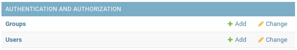

(addusers)=

# Add new users to the app

Navigate to the admin page at `<site url>/admin`.
If you are not logged in, then you’l be prompted to login.
A default admin account is created during the deployment process see [this page](Architecture.md#architecturedescription) for details including the default admin user/pass.
You should see an admin page with the following section:

Click on the `+ Add` button next to the `Users` section.

On this page you’ll be asked to give a username and password for the new user.

Click on the “Save” button and you’ll be then taken to a page that lets you edit the profile of that user.
By default all users are given permissions of just “Active” which means they can log into the web app and navigate the html pages.
If you want someone to be able to admin the site (e.g. log into the admin pages), then you’ll have to set their permissions to include “Staff Status”.
