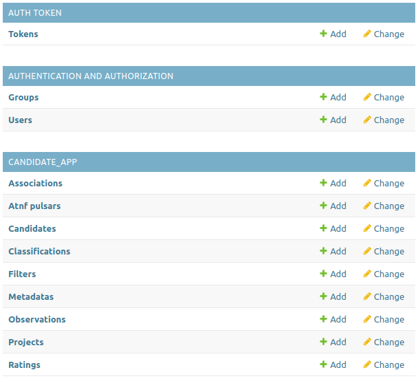
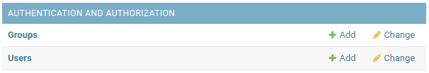
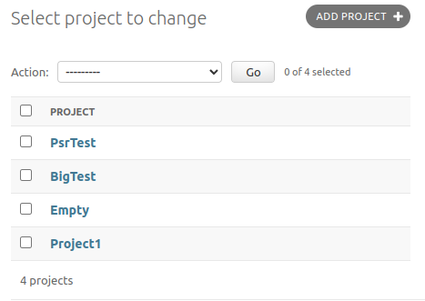

(admin)=

# Admin tasks

When the app is first created a superuser account will be created so that you have at least one valid login to add new users.
Details of the superuser name/password can be found in the [quick start](quick_start.md#settings-files) guide.

All the tasks listed on this page require that you have an admin account which could be the superuser account noted above, or (preferably) a user account with "Staff Status".

To login to the admin pages you'll navigate to the `/admin` site (e.g. `http://mwa-image-plane.duckdns.org/admin`).
There is no link to this page from the web-app, you'll need to type this into your browser directly.

On the left pane you should see three sections:

Each of the rows correspond to a model in the database.
The groups represent the different 'apps' that are installed.

While it is possible to create/view/update/delete any object within the database from the admin page, it is impractical to do so for most of the models.
The models for which the admin page should be used are: Users, Projects, Classifications, and Filters.
These are described below.

(addusers)=

## Managing users

Navigate to the admin page at `<site url>/admin`.
If you are not logged in, then you’l be prompted to login.
A default admin account is created during the deployment process see [this page](Architecture.md) for details including the default admin user/pass.
You should see an admin page with the following section:

Click on the `+ Add` button next to the `Users` section.

On this page you’ll be asked to give a username and password for the new user.

Click on the “Save” button and you’ll be then taken to a page that lets you edit the profile of that user.
By default all users are given permissions of just “Active” which means they can log into the web app and navigate the html pages.
If you want someone to be able to admin the site (e.g. log into the admin pages), then you’ll have to set their permissions to include “Staff Status”.

All the information in the "Personal info" tab is optional and not used in any part of the web app.
It's probably best to keep this empty.

In the "Permissions" tab, you can ignore all the Groups and User permissions, as these attributes are not used in the web app.

**NB**: If you delete a user, all their ratings will be deleted as well.
Any data that was uploaded by a user will be kept.

(manageproject)=

## Managing projects

A project is a collection of candidates.
Each candidate must belong to exactly one project.
Projects are simple, they have a name and a description.
The project name is required and must be unique, where as the description can be any string you like up to 256 characters.
Project names can be up to 64 characters but it is strongly recommended that you keep it to 10 characters or less (so that things look nice on the web pages).

Select the Projects row in the CANDIDATE_APP section of the admin page, and you'll be shown a list of the current projects.

### Adding a project

When viewing the list of current projects select the "ADD PROJECT +" button on the top right of the page.
Alternatively, you can select the + button next to the Projects row in the CANDIDATE_APP section of the admin page.
Enter a project name and description and press "SAVE".

### Modifying a project

When viewing the list of current projects, clicking a project name will show you all the related field of the project (name/description).
You can then see the name/description of the project which are able to be edited.
Pressing SAVE will update the project info.

You can delete a project from this page using the red Delete button.

**NB**: Each candidate has a reference to a project when it is uploaded, if you delete a project then all candidates associated with that project will be deleted (which will also cause the related ratings to be deleted).
This is an efficient way of deleting a lot of candidates and ratings at once which might be exactly what you want, but maybe not so be careful with red buttons.

(manageclassification)=

## Managing classification categories

The list of classifications that can be applied to candidate ratings is dynamic.
All the classifications are stored in their own table which can be edited from this interface.
Classifications are simple items much like Projects mentioned above.
Adding and editing them is done in the same way.

**NB**: Each rating has a classification associated with it.
If you delete a classification then all the ratings which linked to this classification will also be deleted.

(managefilter)=

## Managing filters

Each candidate has an associated filter.
Filters can be managed in the same way as Classfications and Projects.

**NB**: Each Candidate has a Filter associated with it.
If you delete a Filter then all the Candidates which linked to this Fitler will also be deleted.
