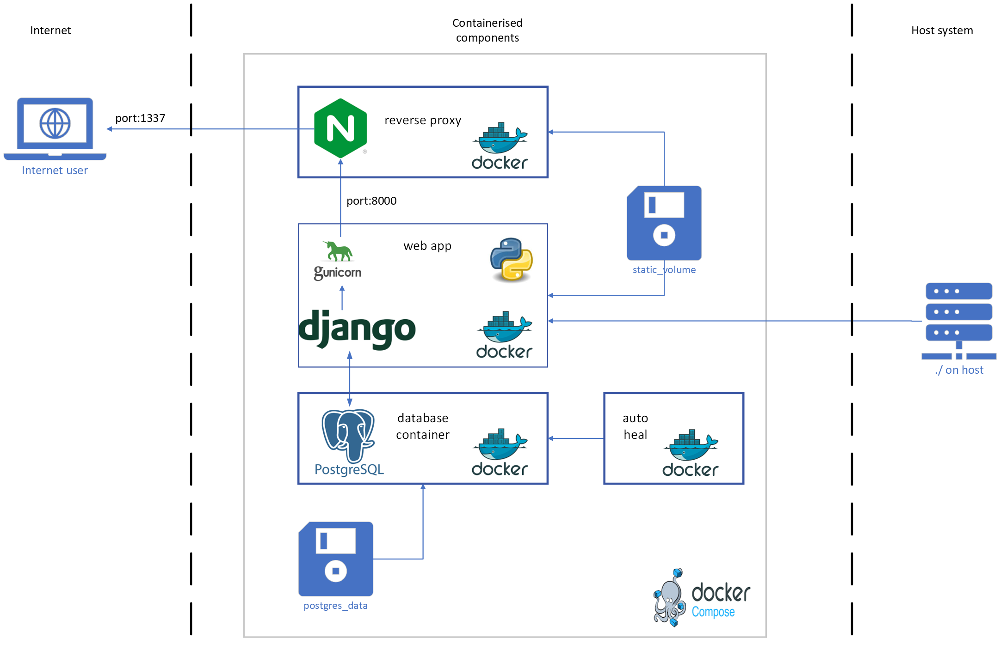
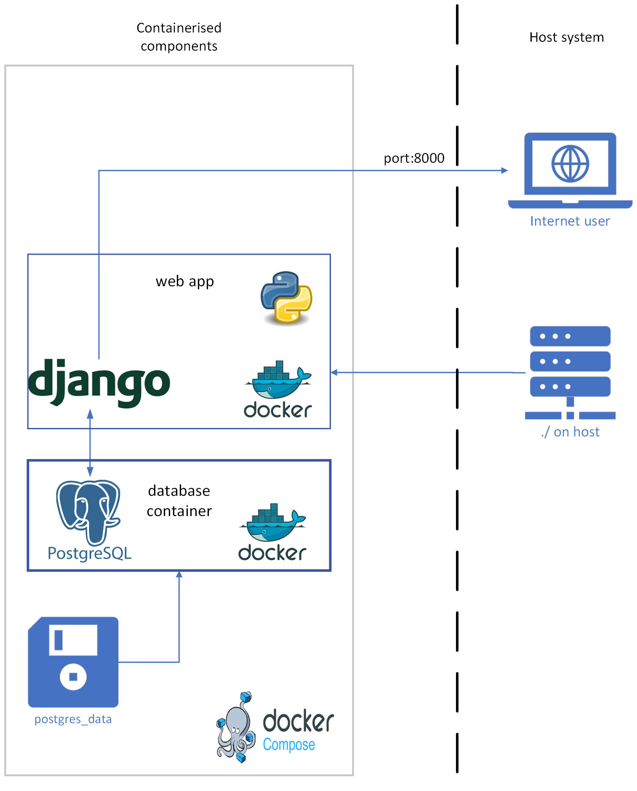

# Architecture description

## Introduction

The MWA image plane transients web app is deployed using docker containers which are managed using `docker compose`.
There are two options for running the web app: a development mode, and a production mode.

### Requirements

To run the web app in either mode you will need the following on your
host machine:

- [Docker](https://docs.docker.com/get-docker/) (v24+)
- [Docker compose](https://docs.docker.com/compose/) (v1.29+)

See [install instructions](https://docs.docker.com/compose/install/)
for docker and docker-compose.

## Production deployment

The production deployment makes use of four containers and three volumes.
The web app runs on code which is in the root of the git repository and this directory is mounted into the web container.
All of the containers and volumes are orchestrated using docker compose.



### First time production setup:

1. Copy `.env.dev` to `.env.prod` and modify the following
   parameters:
   - Turn off debug using `DEBUG=0`
   - Update the `DJANGO_SUPERUSER_PASSWORD` (and optionally
     `USERNAME`), to be something not easily guessable.
   - Create a non trivial `SECRET_KEY` and store it
   - Consider using:
     `python manage.py shell -c "from django.core.management.utils import get_random_secret_key; print(get_random_secret_key())"`
2. Start the web app using
   `docker compose -f docker-compse.prod.yml up`
3. (in different terminal) Collect the static files using
   `docker compose exec web python manage.py collectstatic --noinput`
4. Create and run all migrations:
   - `docker compose exec web python manage.py makemigrations`
   - `docker compose exec web python manage.py migrate`
5. Create a super user (admin) account:
   - `docker compose exec web python manage.py createsuperuser --noinput`

You should now be able to visit `localhost:1337` and see the web app login screen.
Log in using the amin account (user/pass as you set in step 1).

To stop the web app you can `<ctrl>+C` in the terminal that you started in step (2).
To shut down the containers use: `docker compose down`.
To delete the volumes (data) associated with the containers (e.g. make a fresh start) use: `docker compose down -v`.

The containers are described in the following sections.

### Web app

The web app container is where the web app code is run.
This container runs a python environment which is defined in `environment.yml` and includes all the python libraries to run the web application.
Additionally there is the [gunicorn](https://gunicorn.org/) module which is a production grade web server that replaces the default django web server that is run during testing and development.
This container mounts the working directory from the host machine in order to access all the python code that generates the application.
Additionally a volume (static_volume) is mounted in this container which holds all the static files needed to serve the website.

This container is built using the Dockerfile in the root of the repository, and managed via the `docker-compose.prod.yml` file.
The environment variables that are used to control the setup of this container and the operation of the code within are either in the `.env.prod` file or within the `docker-compose.yml` file.

When deployed in production this container will use gunicorn to serve the web app within the container but is not accessible outside of the internal network.
The [nginx](##nginx) container provides external access to this network.

A health check has been configured for this container and the container is considered unhealthy if the login page of the web app becomes inaccessible.

#### Relevant files

1. `containers/Dockerfile`
   - To build the container environment
2. `environment.yml`, `requirements.txt`
   - Defines the python conda environment for the container
3. `.env.prod`
   - Stores all the production settings which are loaded as variables into the web app container
   - See the `.env.dev` for default values for the various parameters
   - This file should **not** be part of the git repository
4. `docker-compose.prod.yml`
   - An orchestration plan which determines which containers are run and how they are linked together

### Database

The database container runs [prostgreSQL](https://www.postgresql.org/) version 15.
The container is pulled from [dockerhub](https://hub.docker.com/_/postgres) and modified to include the [Q3C](https://github.com/segasai/q3c) plugin.
This container mounts a volume called `postgres_data` which is used to store the database files so that they will persist when the containers are shut down.
Environment variables for this container are used to control the database name, and the name/password for the database user.
The environment variables are stored in `.env.prod.db`.

A health check has been configured for this container and the container
is considered unhealthy if the database fails a ready check
(`pg_isready`).

<a id="relevant-files-1"></a>

#### Relevant files

1. `containers/db.Dockerfile`
   - To build the container environment.
2. `.env.prod.db`
   - Defines the postgres user name, password, and database name for the project. See the `.env.dev.db` for default values.
   - This file should **not** be committed to the git repo.
3. `docker-compose.prod.yml`
   - An orchestration plan which determines which containers are run and how they are linked together.

### Nginx

A reverse proxy has been implemented to separate the internal and external networks.
The nginx container uses [nginx](https://www.nginx.com/) as the reverse proxy.
This container mounts the `static_volume` which is used to store and serve static files for the web app.
When docker compose is run you can access the web app by heading to `localhost`.

This container is built using `./nginx/Dockerfile` which is based on the [nginx container](https://hub.docker.com/_/nginx).
The only modification for this container is to add a custom config file `./nginx/nginx.conf` which specifies the location of the static files and upstream web server (gunicorn).

This container does not have a health check.

#### Relevant files

1. `./nginx/Dockerfile`, `./nginx/nginx.conf`
   - Dockerfile and configuration for the nginx service.
2. `docker-compose.prod.yml`
   - An orchestration plan which determines which containers are run and how they are linked together.

### Autoheal

This container runs as a background service to watch the other containers.
If a container has a defined health check and that health check fails then the autoheal service will stop and restart that container.
This container is pulled from [docker hub](https://hub.docker.com/r/willfarrell/autoheal) and used as is.
There are no configurations required for this container.

### Volumes

1. `postgres_data`
   - Used to store data for the database container.
2. `static_volume`
   - Used to store static files needed by the web application.
     This includes background images, banners, icons, `.css` and `.js` files.
     Using this volume means that nginx will serve the static files rather than gunicorn which results in snappier load times, especially if there are a lot of concurrent users of the app.

## Development deployment

The development environment is a simplified version of the production environment and is intended to be run and accessed only from your local machine.
The development environment uses only two containers: the web app, and a database.
The web app is served directly from DJango in a `DEBUG` mode, which means that verbose error pages will be generated when something goes wrong.



### First time development setup

All the configuration needed for the development deployment is set by default in `.env.dev` and the orchestration is handled by `docker-compose.yml`. Starting for the first time is as easy as runing the following:

```bash
docker compose up
docker compose exec web python manage.py makemigrations
docker compose exec web python manage.py migrate
docker compose exec web python manage.py createsuperuser --noinput
```

The web app will be available via `localhost`.

Any changes made to the code will be automatically included in the live site thanks to a state monitoring script that is part of the DJango web server.
