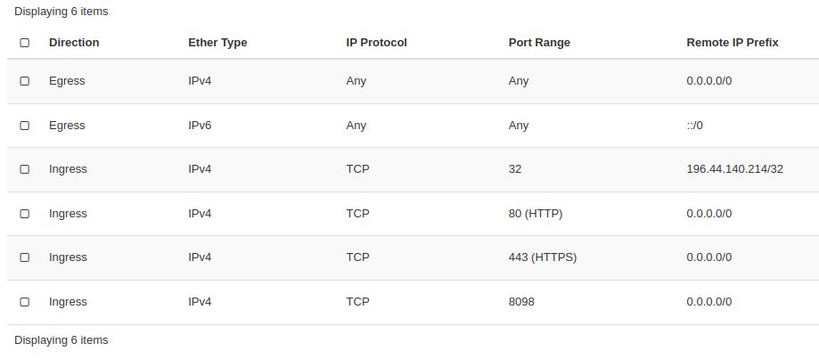

# Allowing external web access from at Nimbus instance

Once you have a nimbus instance, you need to allow access from the web so that you can see your web app.
To do this you should look go to the admin page for your project.

From the left panel select the network tab, and from within this select "Security Groups".
Create a new security group and add the following rules:

