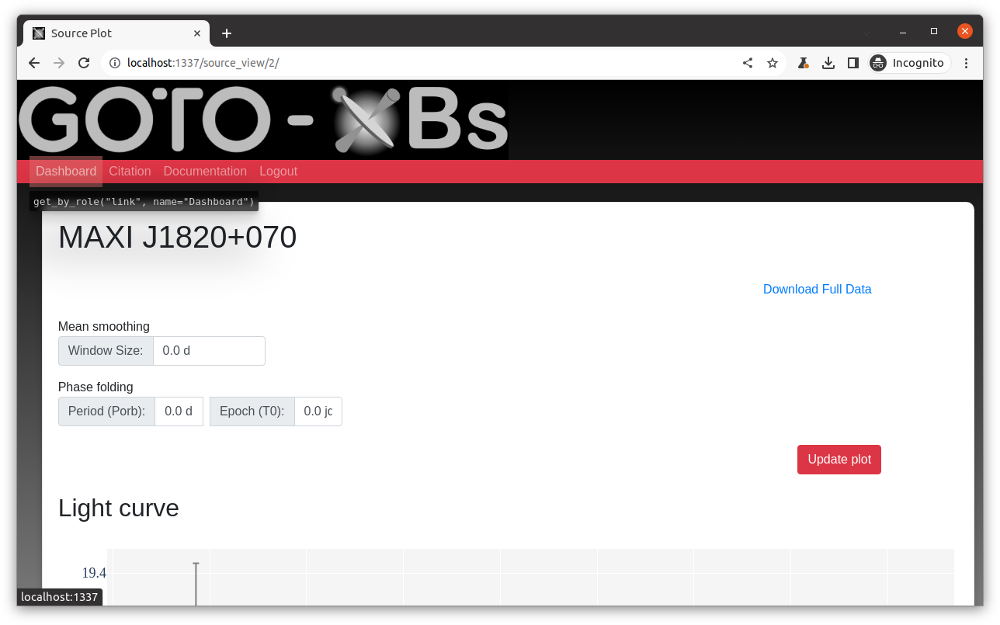
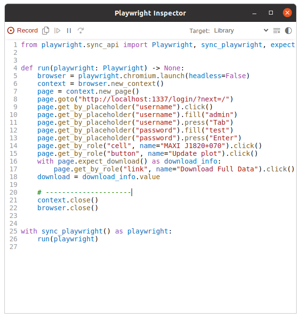

> **NOTE**
> This documentation is not incorrect, however the following tests are not yet implemented for this webapp

(testing)=

# Test the app

There are two types of tests that are run in this app.

- _online_ tests that require the app to be running
- _offline_ tests that can be run at any time

The next two sections detail how to run the tests and how to create new ones.

> **NOTE**
> The tests are designed to be run on the development deployment of the web app.
> See [Development deployment](Architecture.md#development-deployment) for details on how to run a development deployment.

(runtests)=

## Run tests

Tests are designed to be run using [pytest](https://docs.pytest.org/).
The tests are stored in the directory `tests/{online,offline}` with filenames that are `test_<app>.py`.
These files define functions with names like `test_<feaure>`.
With this structure `pytest` will automatically find all the tests that need to be run, run them, and then report the outcomes.

To run the offline tests use:

```bash
python -m pytest tests/offline
```

The offline tests are run on GitHub whenever there is pull request into the main branch.
This action is defined in `.github/workflows/python-offline-test.yml`.

To run the online tests, first ensure that the web app is running locally in development mode, and then use:

```bash
python -m pytest tests/online
```

If the webapp is running then you can run all the tests at once without specifying the directory.

<a id="createtests"></a>

## Create new tests

As noted above all tests should be placed in to `tests/{online,offline}` depending on the nature of the test.
While it is possible to have a different file for every test that you want to do, it is generally a good idea to have one file per app that you are testing, and then have multiple tests within each file.

The structure of a test is as follows:

- A name that starts with `test_` and then includes a description of the test.
  - The name can be long and descriptive because you’ll never call it yourself, but will see the name if the test fails
- (optional) A docstring is to give more information that what is in the name
- Define the expected outcome of some function or action
- Perform the function/action
- Check the output the function and compare to expectations
- If all is fine then do nothing (`return`)
- If anything is not fine then `raise AssertionError` and include a message that describes the problem
  - Where possible, including the expected/actual results is helpful for debugging

### Creating offline tests

Currently there are not that many offline tests as only a few aspects of the web-app can be tested independently.

### Creating online tests

For online tests we need to interact with the web app.
We can do this by using a library like `requests` which will make http(s) requests to a url and return the status of the request as well as the (html/json) results.
An example below does this:

```python
import requests

home_url = "http://localhost/login/"
download_url = "http://localhost/download_page/"
login_data = {"username": "admin", "password": "test"}


def test_download_source():
    with requests.Session() as s:
        # Login and get a token
        s.get(home_url)
        login_data["csrfmiddlewaretoken"] = s.cookies["csrftoken"]

        # use this token to login and get a new one
        s.post(login_url, data=login_data)
        login_data["csrfmiddlewaretoken"] = s.cookies["csrftoken"]

        # Now we can access any page with our token for auth
        r = s.get(download_url, data=login_data)
        if not r.status_code == 200:
            raise AssertionError(r"Failed to view /source/ page")
```

This is a rather simple test, which just makes sure that the `/download_page/` page is accessible, but doesn’t check that the return data is valid.

For a test that relies on interactive components of the website, or which is wanting to check if something is “visible” on the page, then a more advanced library is needed.
For these integration tests we use a package called [playwright](https://playwright.dev/python/).

Playwright allows us to create a workflow of events that correspond to a user navigating a web site.
You start with a page, and then do things to it like `.goto(url)`, find elements with `.get_by_placeholder("username")`, and interact with them with actions like `.fill("admin")`.
Creating the right workflow of events can be tedious and can involve a lot of reading the docs.
However there is a great tool that you can use which will open a web browser, and then watch what you are doing as you navigate pages and interact with them, and finally create a workflow that does all this using the playwright functions.

```bash
playwright codegen localhost
```

This will open two windows for you which are demonstrated below:





Using the information from the above we can create a test as follows:

```python
import pytest
from playwright.sync_api import Page, expect

base_url = "http://localhost:8000"


@pytest.fixture(scope="function", autouse=False)
def login(page: Page):
    # Go to the starting url before each test and login
    page.goto(base_url)
    page.get_by_placeholder("username").fill("admin")
    page.get_by_placeholder("password").fill("test")
    page.get_by_role("button", name="Login").click()
    yield page

    # print("after the test runs")

...

def test_has_login_page(page: Page):
    """
    Ensure that the user is asked to login when navigating to the root page
    """
    page.goto(base_url)
    expect(page).to_have_title("Welcome to GOTO-XBs")
```

Since almost all pages on the site require us to long in to see them, there is a `pytest.fixture` created which will do the login step for us.
This fixture is then used for all the tests in this file.
Instead of calling `raise AssertionError` when something goes bad we can do some simple checks using the `expect` function which has a lot of built-in features for checking things to do with a given page.
