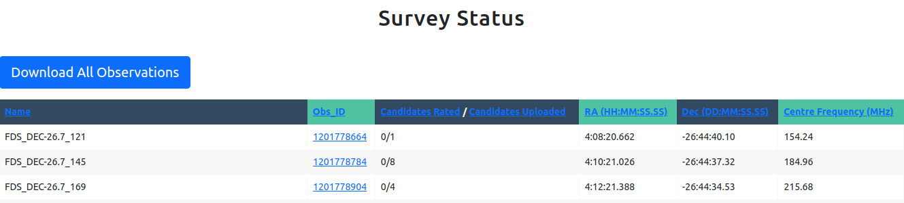
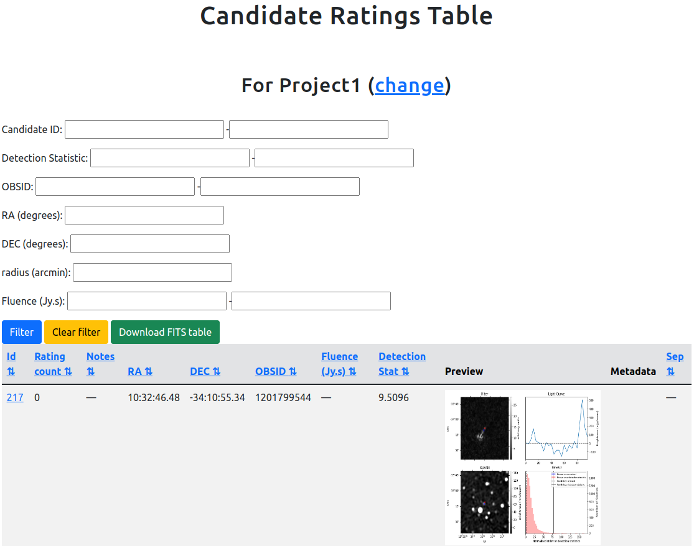
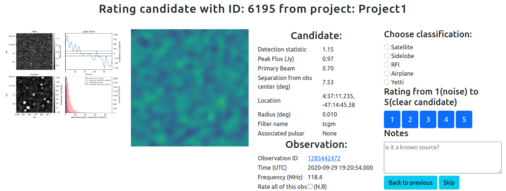
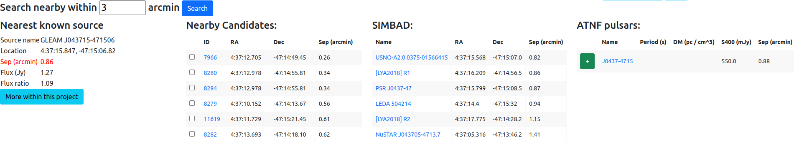

# User Guide

## Home

This page is intentionally blank.

## Survey Status

This page shows a table of all the observations that have been uploaded along with the number of candidates associated with each observation.
Since observations are not associated with projects (see [Session Settings](#session-settings)), this page is an unfiltered view of all observations.
The blue download button allows users to download all the observation data as a FITS table.
The downloaded data contains all the fields associated with the [observation model](databases).

## Candidate Table

This page shows a table of all the candidates that belong to the currently selected project (see [Session Settings](#session-settings)).
From here you can view the candidates, sort the table using the arrows next to the various column headers, filter the table using the form above the table or download the data using the green download button.
The column titled Metadata will show a link when a candidate has metadata associated with it.

If you have not selected a project, or your selected project has no candidates, then you will see an empty table.

The download button will download only the data that matches the current filtering criteria.
If you want all data from a given project, be sure to press the "clear filter" button and apply the filter before downloading.

Clicking on the candidate Id will take you to the corresponding candidate rating page.

## Candidate Rating

This page is the core of the MWA Image Plane Transient Classifier app.
The primary purpose of this page is to give an expert user the ability to see a lot of relevant information about a given `candidate` so that they can provide a `rating`.
The ratings page allows users to apply a `classification`, a confidence `rating`, and some notes.

In the upper section of the page you'll see the following panels:

- A summary diagnostic image
- An animation of the image location over time
- Details on the `candidate` including the associated `pulsar` (if there is one)
- Details of the `observation` from which this `candidate` comes
- A `classification` panel

To rate a candidate:

1. Choose a `classification` (optional)
2. Write/edit notes (optional)
3. Choose a confidence in your `rating` (1-5)

Pressing one of the rating buttons will submit your `rating` and move on to another `candidate` within the same project.

The lower section of the page shows what other `candidate`s, sources (from [Simbad](https://simbad.u-strasbg.fr/simbad/sim-fid)), and `pulsar`s are nearby.
The default operation is to provide a search within 2 acrmin of the current `candidate`, however you can change this using the text box and pressing the search button.

The blue button titled "More within this project" will take you to the candidate table.

The Nearby candidates table shows all the candidates from the current project that are nearby.
Clicking on the blue ID will take you to the candidate ranking page for that candidate.
Selecting the checkbox next to the candidate will mean that whatever `classification`, `rating` and notes you apply to the current candidate will also be applied to the checked candidates from this table.

The Simbad table shows links to the nearby candidates.

The ATNF pulsars table shows all the pulsars that are near to this source.
Clicking on the green `+` button next to a `pulsar` will cause it to be associated with the current `candidate`.
Each `candidate` can have at most one `pulsar` `association`.
If a `pulsar` is already associated with the current `candidate` then you will instead see a red `-` button which, when pressed, undo the association.

## Session Settings

When you are navigating the website not all of the data will be shown in all of the pages.
The session settings page lets you control which subset of the data you'd like to see, and how.
The following can be chosen:

- Project:
  - All of the available projects are listed here.
  - You have to select a project before any candidates will be shown on other pages.
- Candidate ordering:
  - This determines which candidate is selected when you go to the [candidate rating](#candidate-rating) page
- Candidate filtering: ranking
  - TBC unclear what this is for or how it's used.
- Candidate filtering: observing frequency
  - The checkboxes here allow you select only candidates which are observed at a given frequency.
  - You can select multiple frequencies.
  - Selecting none means that all frequencies will be shown.

## Download Data

You can download filtered data from the [candidate table](#candidate-table) page.
The links on this page allow you to download an unfiltered table of data for:

- Ratings
- Candidates
- Observations
- Filters
- Users

The tables are downloaded in FITS format.

## Manage Tokens

When uploading data to the web app using the provided script, you will need an authentication token (instead of username and password).
This page allows you to see your authentication token, and create one if you don't have one.

## Change Password

This page allows a user to reset their password.
