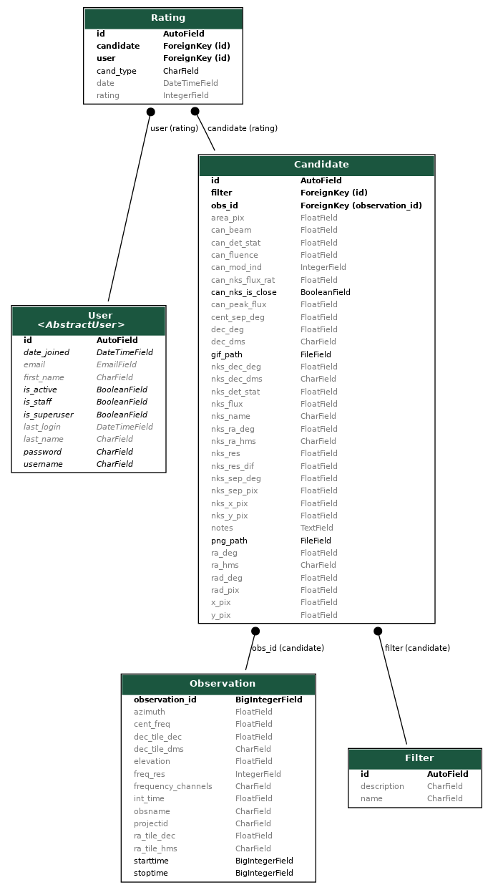

Downloading Data
================

Database structre
-----------------

The database schema has the following structure:

Downloading the data
--------------------

You can download a csv of all the data for each table using the buttons on `this page <https://mwa-image-plane.duckdns.org/download_page/>`_.

Using Pandas to handle the data
-------------------------------

For each csv you can load the data into pandas using

.. code-block::

   import pandas as pd
   df = pd.read_csv("observation.csv")